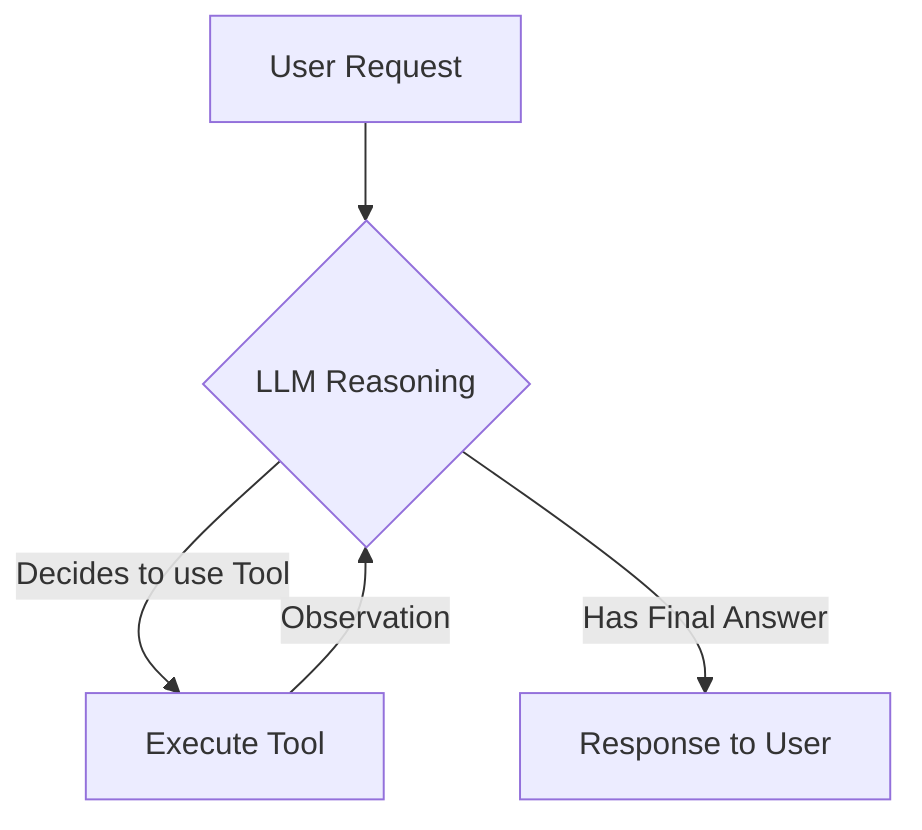

# AI Agents

AI Agents are LLMs that can **use tools** to perform actions, rather than just generating text. They are the "hands" of the AI, while the LLM is the "brain".


## Key Concepts

1.  **ReAct (Reasoning + Acting)**: The agent follows a loop of thinking, acting, and observing.
2.  **Tools**: Functions the agent can call (Calculator, Google Search, Database Query).
3.  **Planning**: Breaking complex goals into smaller steps.
4.  **Memory**: Remembering past actions and results to inform future decisions.

## How Agents Work (ReAct Loop)



## Real-World Use Cases

| Use Case | Description | Tools Used |
| :--- | :--- | :--- |
| **Customer Support** | Answer queries, check order status, process refunds. | Database, Email API, CRM |
| **Coding Assistant** | Write code, run tests, fix bugs automatically. | File System, Terminal, Linter |
| **Data Analyst** | Query databases, visualize data, generate reports. | SQL, Python (Pandas), Plotly |

## Build Your Own Agent (Python)

Here is a conceptual example of how to build a simple agent using LangChain:

```python
from langchain.agents import initialize_agent, Tool
from langchain.llms import OpenAI

# 1. Define Tools
def search(query):
    return "Elon Musk is the CEO of Tesla."

tools = [
    Tool(
        name="Search",
        func=search,
        description="Useful for answering questions about current events."
    )
]

# 2. Initialize Agent
llm = OpenAI(temperature=0)
agent = initialize_agent(tools, llm, agent="zero-shot-react-description", verbose=True)

# 3. Run Agent
agent.run("Who is the CEO of Tesla and what is the stock price?")
```
